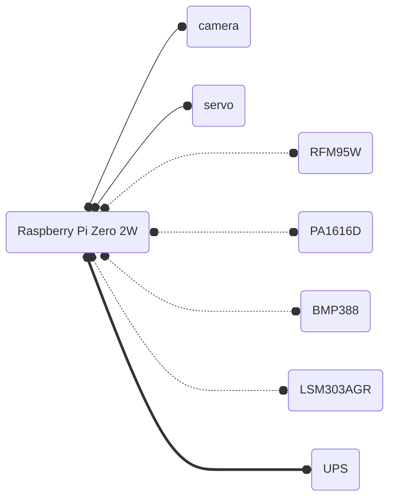

# SBCC Aerospace and Rocketry club avionics source code

# todo
- [x] zero online
- [x] battery online
- [x] accelerometer online
- [x] altimeter online
- [x] camera online
- [ ] gps online
- [ ] components soldered inplace
- [ ] LoRa working with ground station
- [ ] servo control functional
- [ ] black powder ignition functional

# circuit diagram:
